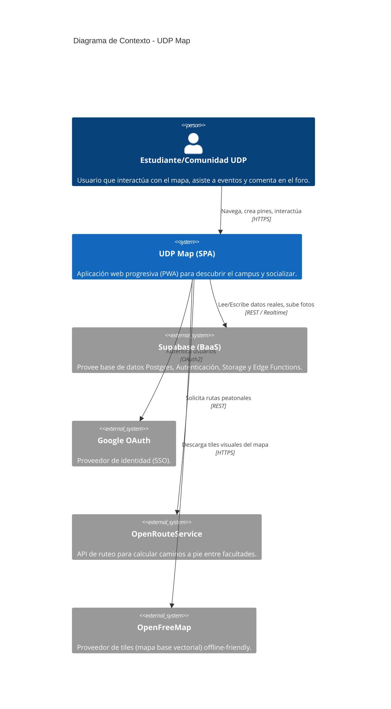
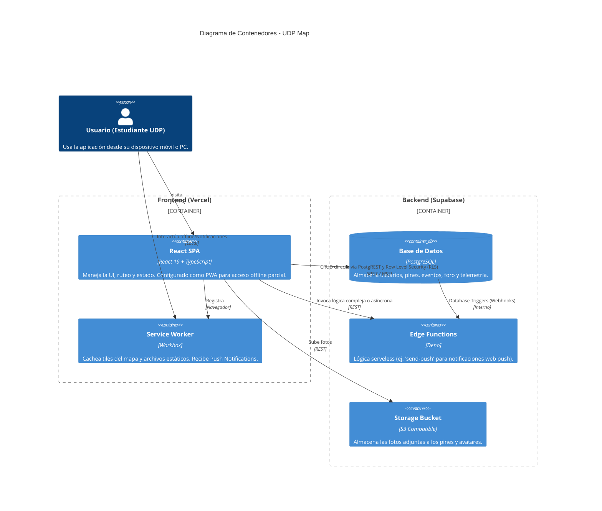
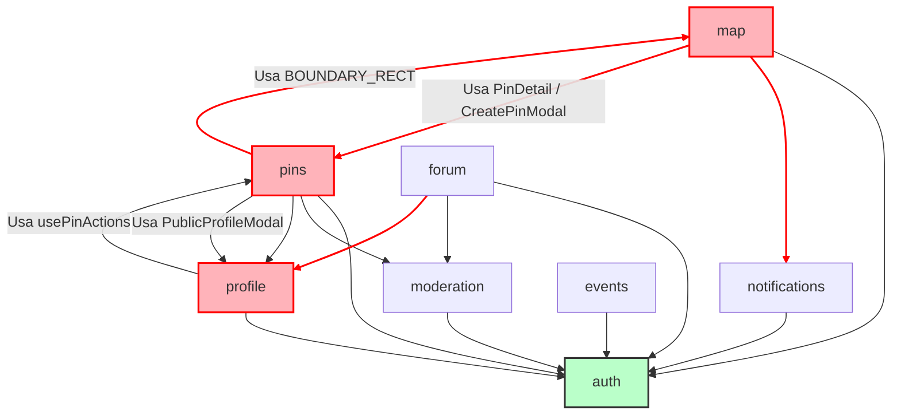
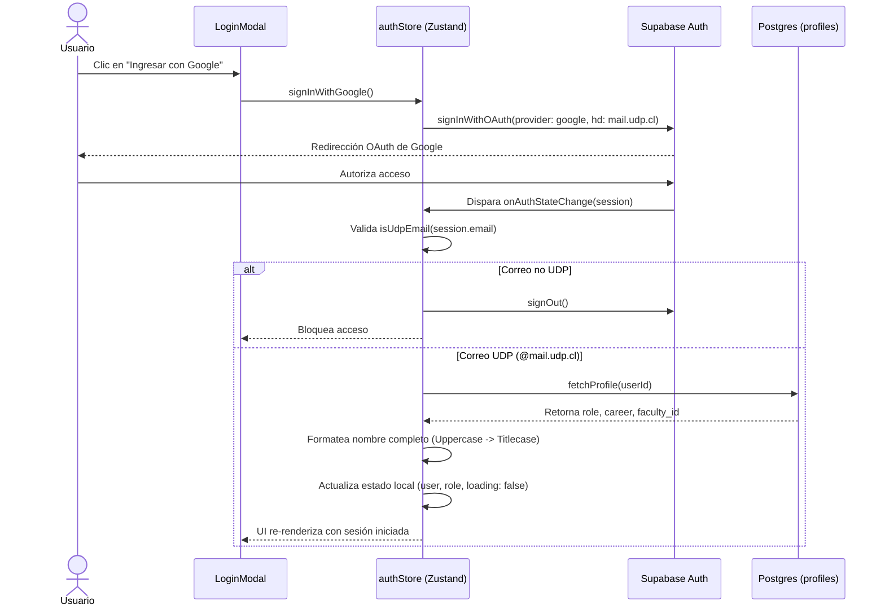
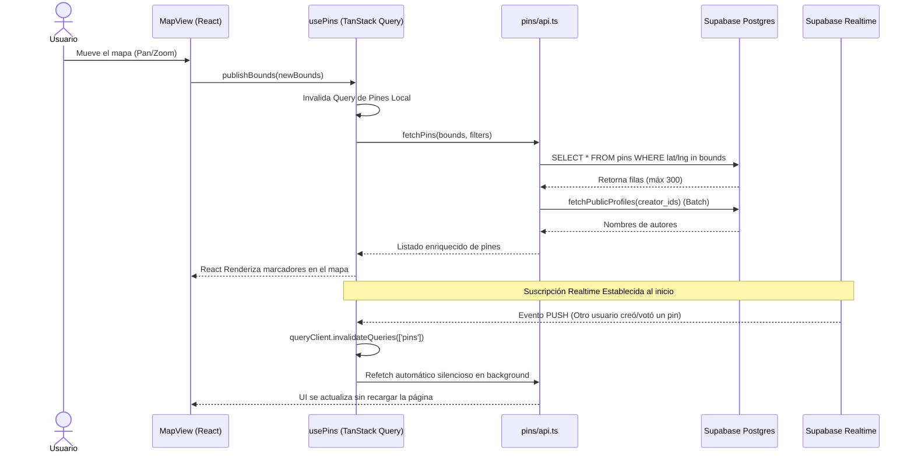
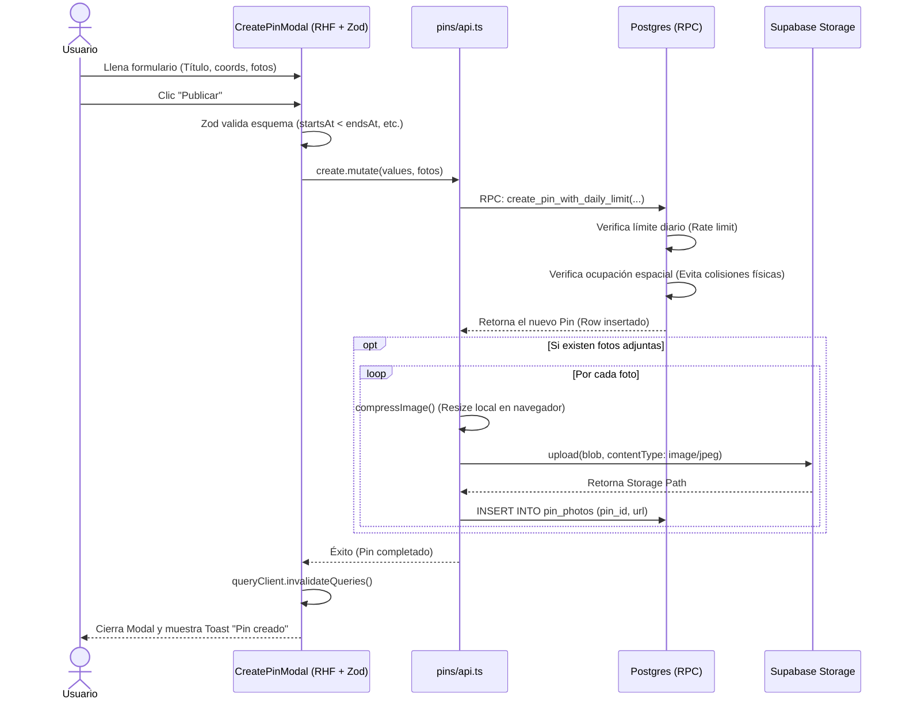

# Auditoría Arquitectónica y Documentación Técnica (UDP Map)

A continuación se presenta el informe arquitectónico completo, estructurado a partir de las 8 fases de auditoría técnica. Este documento contiene la totalidad de los hallazgos, diagramas, matrices y decisiones descubiertas, sin omitir ningún detalle.

---

## 1. Reconocimiento Inicial

A continuación, se detalla el análisis de la estructura general, los puntos de entrada y los manifiestos de configuración del repositorio local de UDP Map (`d:\Code\udp-map`).

### 1.1 Topología del Proyecto (Árbol de Directorios)

El proyecto sigue una arquitectura **basada en características (Feature-Sliced Design / Feature Modules)** en lugar de la clásica separación por capas técnicas (actions, reducers, components). Esto facilita la mantenibilidad a medida que crece.

```text
d:\Code\udp-map\
 ├── .github/          # Workflows de CI/CD
 ├── dist/             # Build output (Vite)
 ├── docs/             # Documentación interna (Changelogs, estado de sprints)
 ├── scripts/          # Utilidades (posiblemente de build/deploy)
 ├── supabase/         # Lógica de backend as a service (migraciones, edge functions)
 ├── src/              # Código fuente principal frontend
 │    ├── app/         # Entry points y enrutador principal (main.tsx, App.tsx, Layout)
 │    ├── features/    # Módulos de negocio delimitados
 │    │    ├── about/
 │    │    ├── admin/
 │    │    ├── auth/
 │    │    ├── events/
 │    │    ├── forum/
 │    │    ├── map/
 │    │    ├── moderation/
 │    │    ├── notifications/
 │    │    ├── pins/
 │    │    └── profile/
 │    ├── shared/      # Código transversal y compartido (UI genérica, utilidades, libs)
 │    │    ├── data/
 │    │    ├── lib/    # Clientes de terceros (QueryClient, i18n)
 │    │    ├── stores/ # Estado global que cruza dominios
 │    │    ├── types/
 │    │    ├── ui/     # Componentes visuales genéricos
 │    │    └── utils/
 │    ├── styles/      # CSS global (Tailwind/index.css)
 │    └── test/        # Setup de testing (Vitest)
 ├── .env.example      # Plantilla de variables de entorno
 ├── eslint.config.js  # Reglas de linting
 ├── package.json      # Dependencias y scripts
 ├── tsconfig.json     # Configuración estricta TypeScript ES2022
 ├── vercel.json       # Hosting app / Serverless overrides
 └── vite.config.ts    # Configuración de empaquetado y PWA
```

### 1.2 Entry Points (Puntos de Entrada)

El flujo de arranque de la aplicación es directo y estándar para Vite + React:

1. **`index.html`**: El documento raíz. Contiene un script para arreglar el comportamiento de `100dvh` en iOS (PWA standalone) e inyecta `/src/app/main.tsx`.
2. **`src/app/main.tsx`**: 
   - Configura interceptores para el evento PWA `beforeinstallprompt`.
   - Llama a `useAuthStore.getState().init()` para arrancar la sesión de usuario antes de renderizar React.
   - Envuelve la aplicación en proveedores de contexto: `GoogleOAuthProvider`, `QueryClientProvider` (TanStack Query) y `BrowserRouter`.
3. **`src/app/App.tsx`**: Define el enrutador principal delegando la navegación a las *Features* correspondientes:
   - `/mapa` -> `MapPage` (Feature: map)
   - `/eventos` -> `EventsPage` (Feature: events)
   - `/foro` -> `ForumPage` (Feature: forum)
   - `/perfil` -> `ProfilePage` (Feature: profile)
   - `/moderacion` -> `ModerationPage` (Feature: moderation)
   - `/admin/*` -> `AdminLayout` (Feature: admin)

### 1.3 Manifiestos y Configuración Global

* **`package.json`**:
  * **Stack Principal**: React 19, React Router v7, Vite v6.
  * **Manejo de Estado / Datos**: `zustand` (cliente) y `@tanstack/react-query` (servidor/caché asíncrona).
  * **Estilos**: Tailwind CSS v4.
  * **Backend / Auth**: `@supabase/supabase-js`, `@react-oauth/google`.
  * **Mapeo**: `maplibre-gl`.
* **`vite.config.ts`**:
  * Extremadamente robusto. Usa `vite-plugin-pwa` para instalarse como aplicación progresiva (PWA) con un Service Worker personalizado (`push-sw.js`).
  * Realiza caché explícita de mapas (tiles y glyphs de OpenFreeMap) usando una estrategia `CacheFirst` para funcionamiento *offline*.
  * Contiene un plugin personalizado en build time para calcular la versión del proyecto inyectando el número de sprint (desde `SPRINTS_STATUS.md`) y el recuento de commits de git. Esto se expone vía la variable mágica `__APP_VERSION__`.
* **`.env.example`**:
  * Delata dependencias de infraestructura críticas:
    * `VITE_SUPABASE_URL` / `VITE_SUPABASE_ANON_KEY`: Base de datos, autenticación y storage.
    * `VITE_ORS_API_KEY`: OpenRouteService (probablemente usado para cálculo de rutas en el mapa).
    * `VITE_GOOGLE_CLIENT_ID`: Autenticación nativa por Google.
    * `VITE_VAPID_PUBLIC_KEY`: Notificaciones Push (Web Push).

> [!TIP]
> **Conclusión del Reconocimiento:** 
> La arquitectura inicial se ve sumamente saludable a nivel organizativo. La decisión de estructurar el código en `features/` en lugar de una bolsa plana de componentes demuestra un entendimiento sólido de mantenibilidad a escala. Asimismo, la configuración estricta de TypeScript, Vite y PWA denota un proyecto que prioriza el rendimiento y la experiencia del usuario (especialmente mobile offline).

---

## 2. Mapeo de Dependencias Externas

El análisis del `package.json` y la inspección del código fuente mediante herramientas de búsqueda nos permite entender las "piezas de lego" sobre las que está construido el sistema y si se están usando de manera óptima o si representan peso innecesario.

### 2.1 Inventario de Dependencias (Categorizado)

| Categoría | Librería | Versión | Propósito Arquitectónico Real |
| :--- | :--- | :--- | :--- |
| **Core** | `react` / `react-dom` | ^19.0.0 | Motor de renderizado principal (usando la última versión mayor). |
| **Enrutamiento** | `react-router-dom` | ^7.1.5 | Manejo de navegación SPA. |
| **Estado Cliente** | `zustand` | ^5.0.3 | Manejo de estado efímero/local global (`authStore`, `uiStore`, `sidebarStore`, `filterStore`). Excelente alternativa ligera a Redux. |
| **Estado Servidor** | `@tanstack/react-query` | ^5.66.0 | Gestión de estado asíncrono, caché, reintentos y mutaciones contra el backend. |
| **Backend / Data** | `@supabase/supabase-js` | ^2.49.1 | SDK del Backend as a Service. Reemplaza la necesidad de un backend propio; maneja Auth, BD (Postgres) y Storage. |
| **Auth Externa** | `@react-oauth/google` | ^0.13.5 | Proporciona el flujo de Single Sign-On nativo de Google (útil para el login institucional de la UDP). |
| **Mapa (Core)** | `maplibre-gl` | ^5.1.0 | Motor de renderizado de mapas WebGL. Decisión excelente (y open source) frente a Mapbox GL JS comercial. |
| **Estilos** | `tailwindcss` | ^4.0.6 | Motor de CSS utilitario (usando la nueva v4, que es más rápida y no requiere postcss explícito). |
| **UI (Primitivas)** | `@radix-ui/react-*` | Varios | Componentes headless (Dialog, Dropdown, Switch, Tabs) usados para construir la UI `shared/ui/` desde cero, garantizando accesibilidad sin imponer estilos (sin depender de shadcn directamente). |
| **Animación** | `framer-motion` | ^12.42.2 | Usado para micro-interacciones avanzadas y el Bottom Sheet arrastrable (`DraggableBottomSheet.tsx`). |
| **i18n** | `i18next` / `react-i18next`| ^24.2 / ^15.4 | Internacionalización fuertemente acoplada en todo el código base (traducciones con `t()`). |
| **Formularios** | `react-hook-form` | ^7.54.2 | Manejo de estado de formularios. |
| **Validación** | `zod` | ^3.24.1 | Validación estricta de esquemas y tipos de datos (se usa en conjunto con hook-form). |
| **Iconos** | `lucide-react` | ^0.475.0 | Paquete estándar y moderno de iconografía. |

### 2.2 Diagnóstico: Fantasmas, Duplicados e Infrautilizados

Tras hacer un rastreo estático en el código base, surgen las siguientes observaciones arquitectónicas:

1. **Acierto Arquitectónico (Zero-Duplication de Fetching)**: 
   No existe `axios`. Toda la comunicación de red probablemente ocurre de forma nativa a través de React Query y el SDK de Supabase. Esto mantiene el bundle size a raya.
2. **Dependencias Infrautilizadas (Heavyweight)**:
   Las librerías `react-hook-form`, `@hookform/resolvers` y `zod` son sumamente potentes, pero un rastreo estricto indica que **solo se utilizan en un único archivo:** `CreatePinModal.tsx`. 
   * **Impacto**: Si la app no tiene muchos formularios complejos interactivos, se está pagando un costo de bundle size considerable (~40kb minimizado) por una validación que podría hacerse de manera nativa o con lógica más ligera para un solo modal.
3. **Ghost Dependencies (Overrides)**:
   El `package.json` incluye un override manual para `punycode` (`^2.3.1`). Esto suele ser una medida parche para eliminar un *Deprecation Warning* de Node.js v21+ que arrojan dependencias profundas (quizás alguna sub-dependencia de correo o URI de supabase/zod), no es código utilizado directamente por la app.

---

## 3. Identificación de Componentes y Responsabilidades (C4 Model)

El repositorio utiliza una arquitectura de **Feature-Sliced Design (FSD)** adaptada. Esto significa que el código no está agrupado puramente por su naturaleza técnica (todos los componentes juntos, todos los hooks juntos), sino por **Dominio de Negocio** (Features).

A continuación, se modela la arquitectura utilizando el estándar **C4 Model** (Contexto y Contenedores) y se cataloga cada componente.

### 3.1 Diagrama de Contexto (Nivel 1)

Muestra a UDP Map y cómo interactúa con el mundo exterior (servicios de terceros).



### 3.2 Diagrama de Contenedores (Nivel 2)

Muestra los contenedores de software que componen la solución y sus responsabilidades tecnológicas.



### 3.3 Catálogo de Componentes Lógicos (Frontend)

El contenedor `React SPA` se divide estructuralmente en 3 grandes macro-capas: `app`, `features`, y `shared`.

#### Capa 1: App (`src/app`)
* **Responsabilidad**: Orquestar el arranque de la aplicación.
* **Componentes**: `main.tsx` (inyecta Providers, QueryClient, Router) y `App.tsx` (define las rutas de alto nivel).

#### Capa 2: Features (`src/features/*`)
Módulos de dominio vertical. Cada uno contiene su propia UI, hooks de estado y capa de acceso a red (`api.ts`).
1. **`auth`**: Maneja el ciclo de vida de la sesión, modales de login (Google) y roles (Admin/Moderator).
2. **`map`**: El lienzo principal. Contiene `Maplibre-gl`, los polígonos de las facultades (`campusBoundary.ts`) y los filtros (`FiltersPanel`).
3. **`pins`**: El corazón del sistema. Lógica de creación de marcadores, expiración de tiempo (TTL), sistema de votos (upvote/downvote), y sección de comentarios en tiempo real.
4. **`events`**: Vista alternativa del mapa centrada en pines de tipo evento y su visualización de calendario.
5. **`forum`**: Sistema tipo Reddit. Hilos de discusión asíncronos (`ThreadDetailModal`), separados geográficamente o por temáticas.
6. **`profile`**: Estadísticas del usuario, gamificación (Badges/Logros), y tabla de clasificación (Leaderboard).
7. **`moderation` & `admin`**: Paneles de control protegidos por rol para gestionar reportes, suspender usuarios o verificar pines oficiales.

#### Capa 3: Shared (`src/shared/*`)
Código transversal sin dependencia direccional hacia las `features`.
* **`ui/`**: Sistema de diseño base (`Dialog`, `ThemeSwitcher`, `Sidebar`). Altamente desacoplado.
* **`stores/`**: Estado global que trasciende un dominio (ej. `filterStore` afecta al mapa y a la vista de eventos).
* **`data/`**: Constantes estáticas (`campusData.ts`, coordenadas en duro).
* **`lib/`**: Envoltorios sobre librerías externas para evitar fugas de acoplamiento (`supabase.ts`, `queryClient.ts`, `i18n.ts`).

---

## 4. Grafo de Dependencias Internas y Acoplamiento

En una arquitectura ideal basada en *Feature-Sliced Design* (FSD), los módulos dentro de `features/` **no deberían importarse entre sí** (acoplamiento horizontal). Si necesitan comunicarse, deben hacerlo a través de eventos, o extrayendo la lógica común a la capa `shared/`.

Al analizar estáticamente las importaciones (imports) entre las carpetas de `src/features/`, descubrimos que el proyecto **viola esta regla repetidamente**, creando una red de acoplamiento oculto.

### 4.1 Grafo de Acoplamiento Horizontal (Mermaid)

El siguiente grafo ilustra cómo las *Features* se conocen entre sí. Las flechas rojas indican dependencias circulares problemáticas.



### 4.2 Reporte de Acoplamiento y Hallazgos Críticos

#### A. Single Point of Failure (SPOF): El módulo `auth`
**Observación**: Absolutamente todas las features importan desde `@/features/auth/` (específicamente `authStore.ts`, `useGuard.tsx` y `permissions.ts`).
**Diagnóstico**: En la práctica, la autenticación y autorización no son una "Feature" aislada, sino un *Cross-Cutting Concern* (preocupación transversal). Al estar ubicado en `features/auth`, rompe la jerarquía.
**Solución Arquitectónica**: `auth` debería moverse a una capa inferior, por ejemplo a `src/app/providers` o `src/shared/auth`.

#### B. Módulos actuando como "Shared UI"
**Observación**: `features/moderation` expone `ReportContentDialog` que es importado directamente por `forum` y `pins`. Del mismo modo, `features/profile` expone `PublicProfileModal`.
**Diagnóstico**: Estos componentes modales son tratados como componentes genéricos transversales en lugar de pertenecer lógicamente a sus módulos.
**Solución Arquitectónica**: Mover estos componentes compartidos a `src/shared/ui/modals/`.

#### C. Dependencia Circular Crítica 1: `map` ↔ `pins`
- **El problema**: `MapPage` (en `map`) importa los componentes pesados `PinDetail` y `CreatePinModal` desde `pins`. A su vez, `PinDetail` (en `pins`) importa `BOUNDARY_RECT` desde `map/campusBoundary.ts`.
- **Impacto**: Los bundlers (Vite/Rollup) suelen manejar bien esto en tiempo de compilación, pero arquitectónicamente hace imposible testear o reutilizar el módulo `pins` sin arrastrar el módulo `map`.
- **Solución Arquitectónica**: `campusBoundary.ts` contiene lógica puramente geoespacial y de negocio estática; debería vivir en `src/shared/data/` o `src/shared/utils/`.

#### D. Dependencia Circular Crítica 2: `pins` ↔ `profile`
- **El problema**: `CommentSection` (en `pins`) importa `PublicProfileModal` (desde `profile`) para mostrar quién comentó. A su vez, `ReportCardWithVote` (en `profile`) importa `usePinActions` (desde `pins`) para permitir moderar desde el perfil.
- **Impacto**: Entrelaza estrechamente la lógica de perfiles de usuario con el motor de pines.
- **Solución Arquitectónica**: La inyección de dependencias o extraer los hooks puramente transaccionales (`usePinActions`) a un store compartido, y mover los modales a `shared`.

---

## 5. Trazado de Flujos Principales (End-to-End)

El trazado de flujos permite entender la "vida del dato" desde que el usuario interactúa con la pantalla hasta que impacta la base de datos y vuelve. Tras analizar el código en `d:\Code\udp-map`, se identificaron los siguientes **3 casos de uso críticos** del sistema:

### 5.1 Flujo de Autenticación Institucional (SSO)

Este flujo garantiza que solo miembros de la comunidad UDP (con correo `@mail.udp.cl`) puedan acceder al sistema, extrayendo su perfil extendido.



### 5.2 Flujo de Lectura Geo-Espacial (Mapa en Realtime)

Este flujo demuestra cómo la aplicación carga los datos espaciales sin saturar la red (usando paginación por límites del mapa y caché) y se mantiene actualizada en vivo.



### 5.3 Flujo de Escritura Compleja (Creación de Pin con Fotos)

Este flujo es quizás el más complejo transaccionalmente. Muestra el manejo de estado de formulario (Zod), límites diarios por usuario y subida múltiple de archivos.



---

## 6. Arqueología Arquitectónica (ADRs Retroactivos)

Al aplicar ingeniería inversa a un proyecto indocumentado, es crucial entender *por qué* el sistema tiene la forma que tiene. Un **ADR (Architecture Decision Record)** captura una decisión de diseño, su contexto y consecuencias.

A continuación, he inferido los 5 ADRs retroactivos más importantes de UDP Map, separando el "sueño" (intención) de la "realidad" (estado actual en código).

### ADR-001: Agrupación Estructural por Dominio (Feature-Sliced Design)

**El Contexto**: Las aplicaciones React clásicas tienden a escalar agrupando por rol técnico (todas las vistas en `/views`, todos los servicios en `/services`). A medida que UDP Map crecía con módulos como el foro, eventos y moderación, este enfoque no escalaba.
**La Decisión**: Adoptar un modelo de "Feature Modules" ubicando los recursos en `src/features/*`.

* **Intención Aparente**: Lograr alta cohesión. Que un desarrollador trabajando en el Foro solo tuviera que tocar archivos de la carpeta `/forum` sin impactar al resto del proyecto.
* **Realidad Observada (Deuda Identificada)**: El aislamiento fracasó. La estructura de carpetas existe, pero las fronteras no se respetan. La feature `map` importa masivamente de `pins`, y `pins` importa de `profile`. Se obtuvo la "estética" del patrón, pero **no el aislamiento lógico**.

### ADR-002: Separación de Estado (Zustand + TanStack Query vs Redux)

**El Contexto**: Manejar el estado global del usuario, el mapa activo, y las respuestas del servidor simultáneamente puede requerir cientos de líneas de boilerplate en Redux.
**La Decisión**: Renunciar a un único "Árbol de Estado" monolítico. Usar `Zustand` exclusivamente para el estado efímero del cliente (sidebar, UI) y `@tanstack/react-query` para el estado asíncrono que pertenece al servidor.

* **Intención Aparente**: Reducir el boilerplate, simplificar el fetching de datos y manejar la caché de red de forma automática y declarativa.
* **Realidad Observada**: **Éxito rotundo**. Es una de las mejores decisiones técnicas del proyecto. No hay efectos secundarios (`useEffect`) innecesarios haciendo *fetch* de datos espagueti; todo fluye limpiamente a través de queries invalidadas.

### ADR-003: Backend-less Frontends vía Supabase (BaaS)

**El Contexto**: Crear una API REST/GraphQL (en Node o Python) requeriría mantener infraestructura extra, un ORM, controladores y rutas, duplicando el tiempo de desarrollo.
**La Decisión**: Conectar el frontend en React directamente a una base de datos PostgreSQL utilizando el cliente de Supabase (PostgREST + Realtime + GoTrue).

* **Intención Aparente**: Velocidad extrema de entrega (Time-to-Market), delegando la seguridad a políticas a nivel de fila (RLS) en la base de datos.
* **Realidad Observada**: Se ejecutó de manera excepcionalmente inteligente. Lejos de dejar la base de datos vulnerable por acceso directo, las operaciones críticas (como votar o crear pines verificando límites diarios) fueron empujadas hacia **RPCs (Procedimientos Almacenados en SQL)** en el backend, blindando la lógica de negocio lejos del frontend.

### ADR-004: Primitivas UI Headless (Radix) en lugar de Frameworks UI (MUI/Ant)

**El Contexto**: El proyecto exigía una interfaz de usuario hiper-personalizada, de aspecto nativo móvil, animada y con una estética tipo "glass-hud" (mencionada en los estilos).
**La Decisión**: No utilizar Material UI o Bootstrap. Escribir los componentes visuales de cero (`shared/ui`) usando Tailwind CSS, pero apalancándose en `@radix-ui` (componentes sin estilo) para manejar la accesibilidad (teclado, ARIA, focus traps) de Modales y Dropdowns.

* **Intención Aparente**: Tener el control total de los píxeles y animaciones sin pelear contra la especificidad de CSS inyectado por librerías comerciales pesadas.
* **Realidad Observada**: El resultado visual y de accesibilidad es excelente. Sin embargo, trajo como consecuencia una **sobreingeniería local**: librerías de formularios pesadas (`react-hook-form` y `zod`) que pesan 40kb y terminaron siendo implementadas para controlar *un solo modal* (`CreatePinModal`).

### ADR-005: PWA Caching Agresivo para Tiles Espaciales

**El Contexto**: La conectividad en los campus universitarios (o en el metro al acercarse) puede ser inestable. Un mapa que carga un "cuadrado gris" al quedarse sin internet produce una UX inaceptable.
**La Decisión**: Configurar la aplicación como una Progressive Web App (PWA) e inyectar Workbox para interceptar el tráfico de red mediante un Service Worker.

* **Intención Aparente**: Hacer la app robusta offline, cacheando los tiles cartográficos de OpenFreeMap para que el esqueleto geográfico siempre cargue.
* **Realidad Observada**: La configuración manual en `vite.config.ts` tiene estrategias `CacheFirst` explícitas para `tiles.openfreemap.org`, y un límite masivo de expiración de 30 días para estos recursos. Es una decisión de infraestructura de grado empresarial implementada exitosamente a nivel front-end.

---

## 7. Diagnóstico Exhaustivo de Deuda Técnica

Aunque el proyecto se beneficia de un stack moderno (React 19, Zustand, Supabase, Tailwind 4), la **velocidad de desarrollo ha generado una cantidad significativa de deuda técnica estructural** que amenaza la escalabilidad a largo plazo.

### 7.1 Matriz Priorizada de Deuda Técnica

| Categoría | Ubicación / Elemento | Severidad | Impacto en Negocio/Dev | Esfuerzo de Refactor |
| :--- | :--- | :---: | :--- | :---: |
| **Arquitectura** | **Acoplamiento Circular y Feature Envy** (`map` ↔ `pins` ↔ `profile`) | 🔴 Crítica | Imposibilita testear o extraer módulos. Modificar la forma de visualizar un pin puede quebrar la vista del perfil de usuario. Viola el patrón FSD. | Medio |
| **God Object** | **`features/map/MapPage.tsx`** (750+ líneas) | 🔴 Crítica | Centraliza renderizado, orquestación de modales, y manejo crudo de APIs del dispositivo (Giroscopio `DeviceOrientationEvent` y `navigator.geolocation` con *workarounds* para iOS/Brave). Viola SRP (Single Responsibility Principle). | Alto |
| **God Store** | **`shared/stores/uiStore.ts`** | 🟠 Alta | Concentra absolutamente **todo** el estado efímero de la aplicación: Modales (Login, Creación, Tutorial), Modos del mapa (2D/3D), Lógica Indoor, Ruteo, y sistema de Toasts. Esto provoca re-renders innecesarios y cuellos de botella en el estado. | Bajo (Split de stores) |
| **God Object** | **`features/pins/api.ts`** (500+ líneas) | 🟠 Alta | Actúa como un "Cajón de Sastre" para todas las operaciones de red de Pins, Comentarios, Favoritos y Votos, incluyendo la lógica de fallback offline (Demo DB). Si dos devs tocan entidades distintas del mapa, habrá conflictos de Git. | Medio |
| **Fat Component** | **`features/pins/CreatePinModal.tsx`** (700+ líneas) | 🟠 Alta | Mezcla UI compleja móvil/desktop, validación Zod, lógica de compresión nativa de imágenes (`canvas`), y gestión de errores de Supabase RPC. La lógica de negocio no está separada de la vista. | Medio |
| **Lógica Híbrida** | **`features/forum/ThreadDetailModal.tsx`** (550+ líneas) | 🟡 Media | Componente recursivo que mezcla la manipulación algorítmica de árboles de comentarios (`buildCommentTree`) con el renderizado en sí (`CommentItem`) en el mismo archivo. | Bajo |
| **Bloatware** | `react-hook-form` + `zod` | 🟡 Media | Se importa una librería pesada de gestión de formularios que impacta el *bundle size* (~40kb gzip), pero **solo se utiliza en un único modal** (`CreatePinModal`). | Alto (Reescribir) |
| **Violación DRY** | Modales de `shared/ui/Dialog` | 🟡 Media | Aunque existe un wrapper `<Dialog>`, los archivos que lo consumen re-implementan el esqueleto interior (Header, Botón X, Paddings) manualmente con clases de Tailwind repetidas, perdiendo uniformidad visual. | Bajo |

### 7.2 Análisis Exhaustivo de Anti-patrones Observados

#### A. "Feature Envy" (Envidia de Funciones)
Como se observó estáticamente en la Fase 4, los módulos saben demasiado de los detalles de implementación de los demás.
* **Ejemplo Crítico**: `features/pins/PinDetail.tsx` importa de `features/map/campusBoundary.ts` para validar coordenadas. La lógica de negocio espacial (el perímetro del campus) no debería pertenecer al contenedor de vista `map`. Debería vivir en un módulo neutral en `shared/data` o `shared/utils`.

#### B. "State Hook Bloat" (Abuso de Stores Globales)
`uiStore.ts` maneja más de 30 variables y métodos de estado diferentes. En Zustand, si un componente se suscribe a `useUIStore()`, corre el riesgo de re-renderizarse por cambios no relacionados (ej. cambiar el estado de un Toast re-renderiza componentes que escuchan el modo Indoor) a menos que se usen selectores atómicos estrictos. 
* **Solución Ideal**: Dividir en `modalStore.ts`, `toastStore.ts`, `mapUIStore.ts`.

#### C. Fuga de Lógica de Negocio en Vistas (Smart UI Anti-pattern)
Archivos como `CreatePinModal` y `ForumPage` ejecutan mutaciones (ej. `voteMutation.mutate(...)`) o procesan blobs (imágenes) directamente dentro del ciclo de vida del componente React. 
* **El Problema**: Hace imposible testear la lógica sin montar un DOM virtual (jsdom). La lógica de compresión de imagen y validación de coordenadas debería estar abstraída en *servicios* puros o *hooks transaccionales*.

#### D. "Ice Cream Cone" (Pirámide de Testing Invertida)
La estructura de tests del proyecto asume integración end-to-end, pero ignora la base. Hay tests para constantes y helpers (`forum.test.ts`), pero **no hay cobertura para los God Objects** (`MapPage`, `CreatePinModal`). Dada su alta mezcla de dependencias (UI + Red + APIs de hardware), testear estos componentes críticos es actualmente imposible sin un refactor masivo previo (Inversión de Control).

---

## 8. Arquitectura "Target" (El Futuro)

Para sanear la deuda técnica documentada y soportar el futuro, proponemos migrar la estructura actual hacia la siguiente topología de carpetas e inversión de control:

```text
📁 src/
  📁 app/                 # Arranque, Enrutadores (App.tsx, main.tsx)
  
  📁 shared/              # Capa de Fundaciones Compartidas (Ninguna conoce a Features)
     📁 auth/             # MIGRADO: authStore, permissions, useGuard (SPOF resuelto)
     📁 data/             # MIGRADO: campusBoundary.ts (resuelve dependencias circulares)
     📁 stores/           # SPLIT: mapState.ts, modalState.ts, userState.ts (adiós God Store)
     📁 ui/               
        📁 core/          # Componentes tontos (Dialog, Button)
        📁 modals/        # MIGRADO: ReportContentDialog, PublicProfileModal 
     📁 utils/
        📁 geolocation/   # MIGRADO: useUserLocation.ts (Desinfla MapPage.tsx)

  📁 features/            # Dominios puramente aislados (Regla: no importarse entre sí)
     📁 forum/            
        📁 ui/            # ThreadCard.tsx y CommentItem extraídos.
     📁 map/              # MapPage.tsx ahora tiene < 200 líneas.
     📁 pins/             
        📁 services/      # SPLIT: pinApi.ts, voteApi.ts, commentApi.ts (adiós God Object de red)
```

### Roadmap de Sprints Sugerido
1. **Limpieza del Kernel**: Extraer `auth`, las barreras geográficas (`campusBoundary`) y los modales transversales (`ReportDialog`) a la carpeta `shared`.
2. **Refactor de God Objects**: Separar la lógica pura de GPS de `MapPage.tsx`. Desmontar `CreatePinModal.tsx` abstrayendo la compresión de fotos a un servicio.
3. **Optimización de Estado**: Trozar `uiStore.ts` en mini-stores atómicos.
